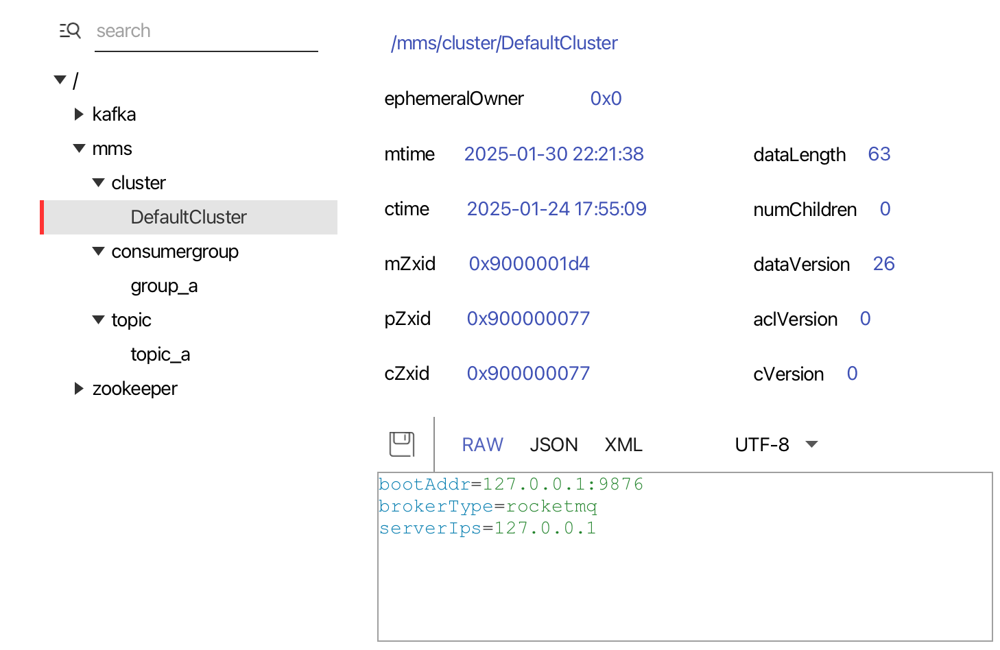
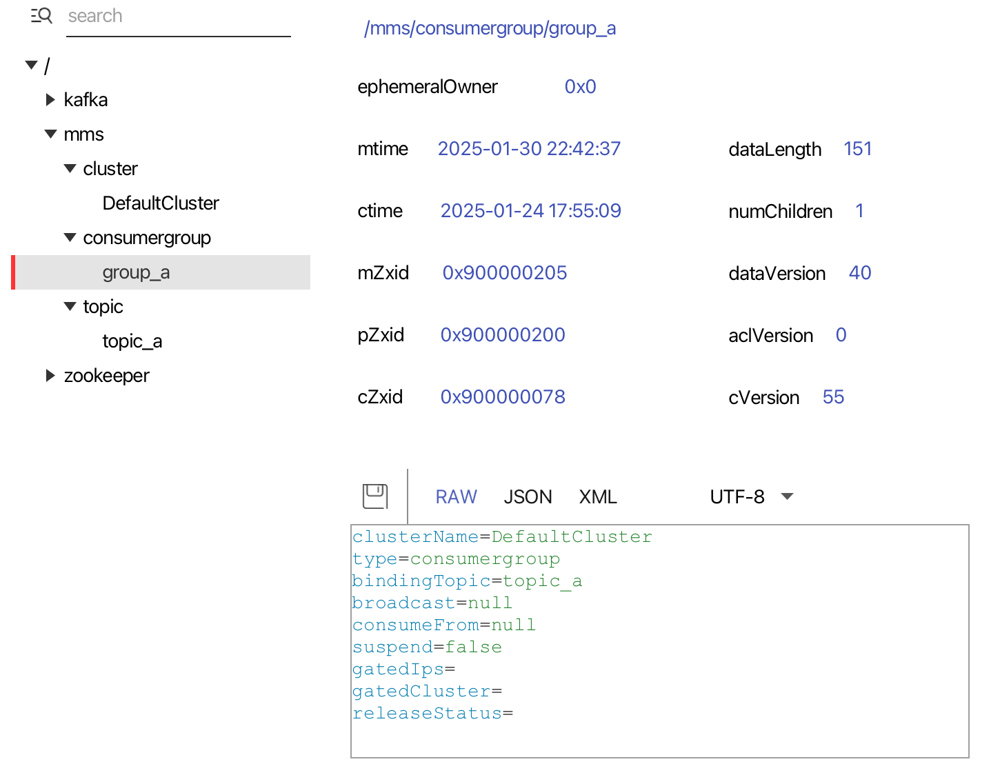
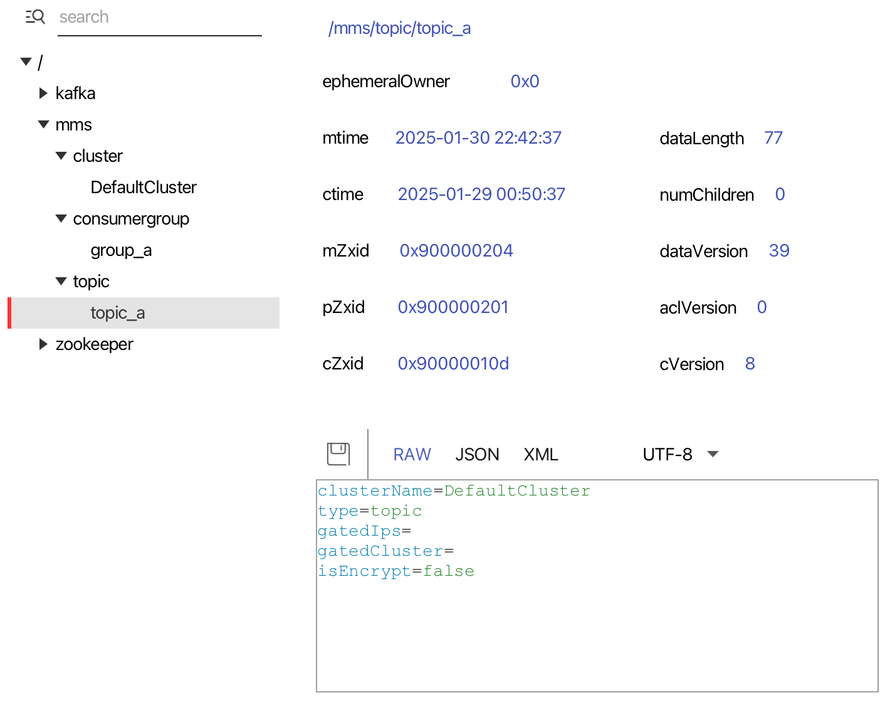

MMS
---
[my-message-service git项目](https://github.com/Bannirui/my-message-service.git)

### 1 目的
对msb屏蔽掉mq中间件的平台差异性 约定统一性配置

### 2 效果
- 以zk为注册中心 将mq(集群/topic/consumer)的元数据写入到zk中
- msb从zk中拉取到元数据进行消息的发送和订阅

### 3 znode路径节点
- 集群信息 /mms/cluster/${cluster_name}

- consumer信息 /mms/consumergroup/${group_name}

- topic信息 /mms/topic/${topic_name}
