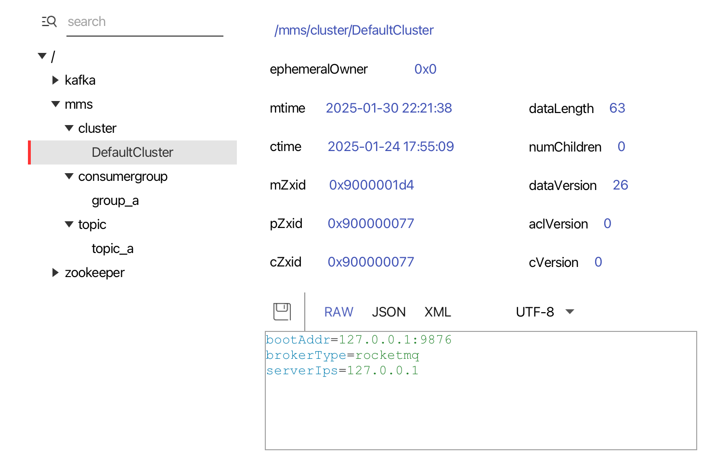

MMS
---
[my-message-service git项目](https://github.com/Bannirui/my-message-service.git)

### 1 目的
对msb屏蔽掉mq中间件的平台差异性 约定统一性配置

### 2 效果
- 以zk为注册中心 将mq的元数据
  - 集群
  - topic
  - consumer
- 生产者只关注topic 去注册中心拿到配置 创建对应生产者的代理对象
- 消费者只关注consumer 去注册中心拿到配置 创建对应消费者的代理对象

### 3 znode路径节点
- 集群信息 /mms/cluster/${cluster_name}

- consumer信息 /mms/consumerGroup/${group_name}

- topic信息 /mms/topic/${topic_name}

### 4 有环境概念怎么区分zk的连接
对于mms而言有环境概念，但是对于mq没有环境概念，因此需要在注册中心那一层就屏蔽掉环境，在线程中携带环境选择不同的zk，自然在zk中的注册信息就不需要用环境区分了