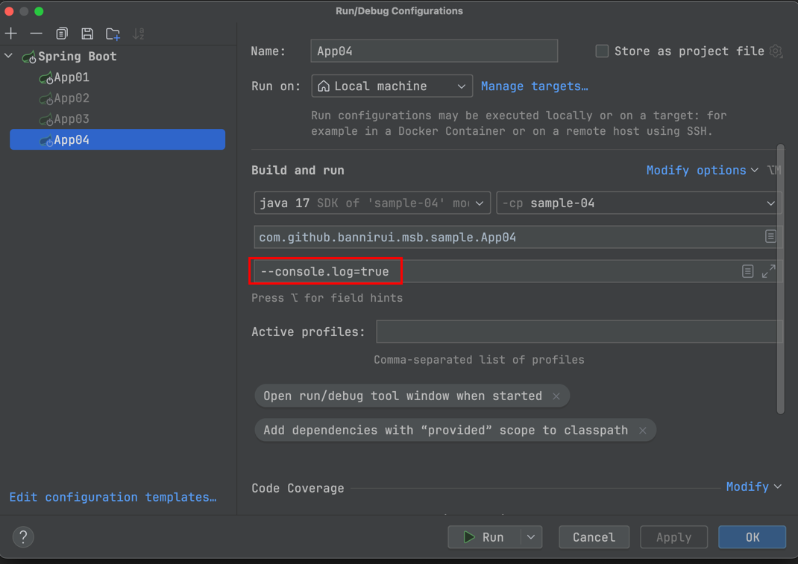

控制台日志输出Banner
---

### 1 maven的依赖GAV

```xml
<parent>
    <groupId>com.github.bannirui</groupId>
    <artifactId>my-springboot</artifactId>
    <version>3.2.4</version>
</parent>
```

### 3 配置文件

classpath:META-INF/app.properties

```properties
app.id=SampleApp
```

### 5 启动类注解

- @EnableMsbFramework
- @EnableMsbLog

```java
@EnableMsbFramework
@EnableMsbLog
public class App04 implements ApplicationRunner {
    private static final Logger logger = LoggerFactory.getLogger(App04.class);

    public static void main(String[] args) {
        logger.info("App4启动");
        SpringApplication.run(App04.class, args);
    }

    @Override
    public void run(ApplicationArguments args) throws Exception {
        logger.info("应用已经启动 开始执行定制服务");
    }
}
```

### 4 运行参数

运行的时候指定参数`--console.log=true`



### 6 运行结果

