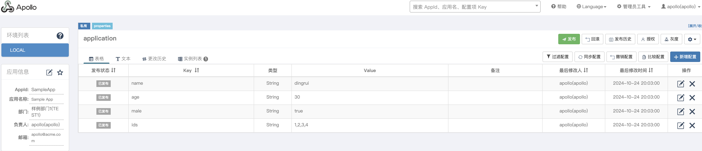
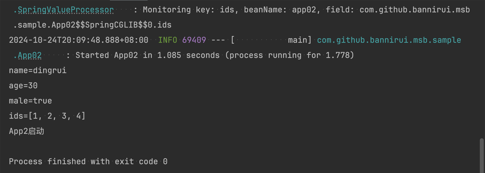

读取远程配置
---

远程配置中心整合的是Apollo

### 1 Apollo远程配置



### 2 maven的依赖GAV

```xml
<parent>
    <groupId>com.github.bannirui</groupId>
    <artifactId>my-springboot</artifactId>
    <version>3.2.4</version>
</parent>
```

### 3 配置文件

classpath:META-INF/app.properties

这个配置文件是Apollo会读取app.id的地方

```properties
app.id=SampleApp
```

### 4 JVM参数

运行的时候指定参数`-Denv=dev`

这个参数也是为可给apollo指定对应环境的meta url使用的

根据需求指定，可选为

- dev
- fat
- uat
- prod

### 5 启动类上打上注解@EnableMyFramework和注解@EnableMsbConfig

===注解必须打在启动类上===

```java
@EnableMsbFramework
@EnableMsbConfig
public class App02 implements CommandLineRunner {

    @Value("${name}")
    private String name;

    @Value("${age}")
    private Integer age;

    @Value("${male}")
    private Boolean male;

    @Value("${ids}")
    private List<Long> ids;

    public static void main(String[] args) {
        SpringApplication.run(App02.class, args);
        System.out.println("App2启动");
    }

    @Override
    public void run(String... args) throws Exception {
        System.out.println("name=" + this.name);
        System.out.println("age=" + this.age);
        System.out.println("male=" + this.male);
        System.out.println("ids=" + this.ids);
    }
}
```

### 6 运行结果

