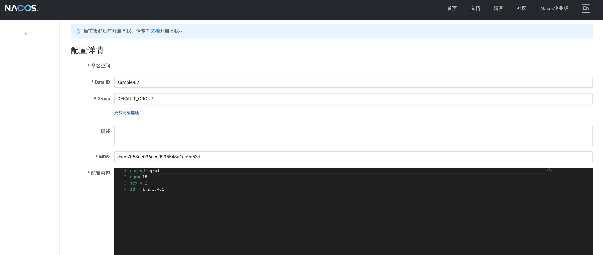
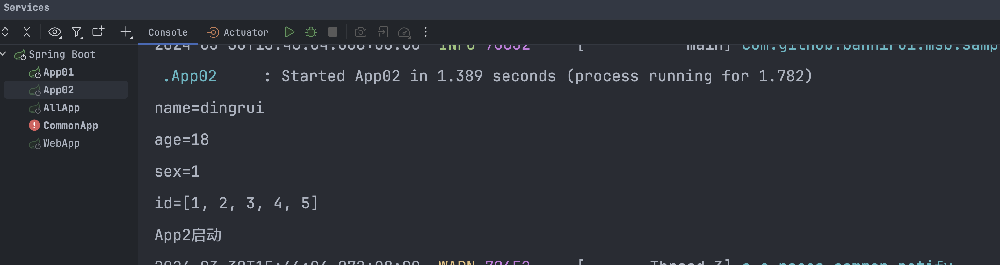

读取远程配置
---

远程配置中心整合的是Nacos

### 1 nacos服务端



### 2 maven的依赖GAV

```xml
<parent>
    <groupId>com.github.bannirui</groupId>
    <artifactId>my-springboot</artifactId>
    <version>3.2.4</version>
</parent>
```

### 3 启动类上打上注解@EnableMyFramework和注解@EnableMyRemoteCfg

===注解必须打在启动类上===

```java
@EnableMyFramework
@EnableMyRemoteCfg(dataId = {"sample-02"})
public class App02 implements CommandLineRunner {

    @Value("${name}")
    private String name;

    @Value("${age}")
    private Integer age;

    @Value("${sex}")
    private Long sex;

    @Value("${id}")
    private List<Integer> id;

    public static void main(String[] args) {
        SpringApplication.run(App02.class, args);
        System.out.println("App2启动");
    }

    @Override
    public void run(String... args) throws Exception {
        System.out.println("name=" + this.name);
        System.out.println("age=" + this.age);
        System.out.println("sex=" + this.sex);
        System.out.println("id=" + this.id);
    }
}
```

### 4 配置文件

classpath:META-INF/application.yml

```yaml
app:
  id:
    sample-02
```

### 5 JVM参数

运行的时候指定参数`-Denv=dev`

根据需求指定，可选为

- dev

- test

- prod

### 6 运行结果

