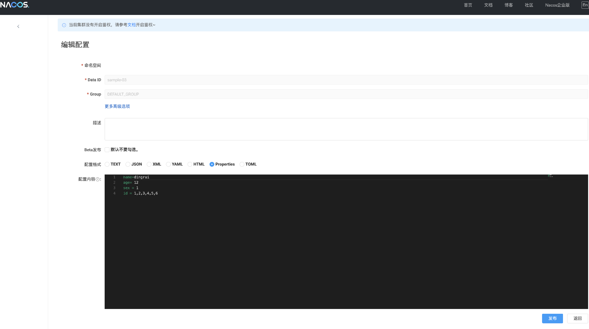

远程配置热更新
---

支持热更新的数据类型

- String

- Integer

- Long

- Short

支持热更新的使用场景

- @Value注解打在类的成员上

- @Value注解打在类的方法上，但是该方法只能是setter方法

### 1 Nacos服务端配置



### 2 maven依赖

```xml
<parent>
    <groupId>com.github.bannirui</groupId>
    <artifactId>my-springboot</artifactId>
    <version>3.2.4</version>
</parent>
```

### 3 配置文件

配置文件路径`classpath:META-INF/application.yml`

```yaml
app:
  id:
    sample-03
```

### 4 场景启动器注解打在启动类上

```java
@EnableMyFramework
@EnableMyRemoteCfg(dataId = {"sample-03"}, hotReplace = true)
public class App03 implements CommandLineRunner {

    @Autowired
    private ApplicationContext context;

    @Value("${name}")
    private String name;

    @Value("${age}")
    private Integer age;

    @Value("${sex}")
    private Long sex;

    @Value("${id}")
    private List<Integer> id;

    public static void main(String[] args) {
        SpringApplication.run(App03.class, args);
        System.out.println("App3启动");
    }

    @Override
    public void run(String... args) throws Exception {
        Executors.newSingleThreadScheduledExecutor()
            .scheduleAtFixedRate(() -> {
                System.out.println("name=" + App03.this.name);
                System.out.println("age=" + App03.this.age);
                System.out.println("sex=" + App03.this.sex);
                System.out.println("id=" + App03.this.id);
                System.out.println();
            }, 2_000L, 5_000L, TimeUnit.MILLISECONDS);
    }
}
```

### 5 JVM启动参数指定环境参数

-Denv=dev