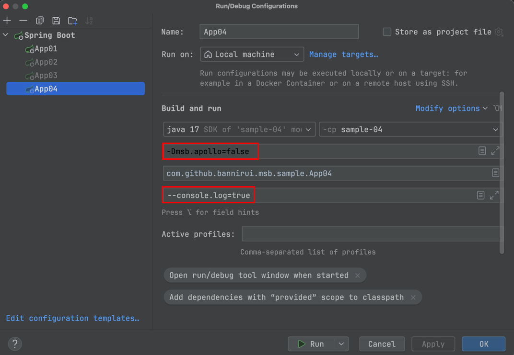
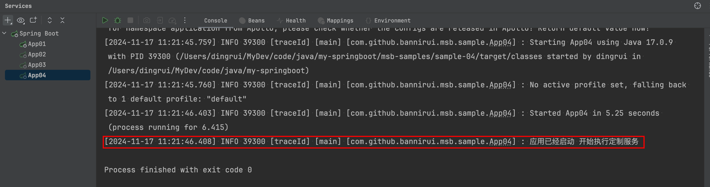

日志集成Cat
---

### 1 maven的依赖GAV

```xml
<parent>
    <groupId>com.github.bannirui</groupId>
    <artifactId>my-springboot</artifactId>
    <version>3.2.4</version>
</parent>
```

### 3 配置文件

classpath:META-INF/app.properties

```properties
app.id=SampleApp
```

### 3 启动类注解

- @EnableMsbFramework
- @EnableMsbConfig
- @EnableMsbLog

```java
@EnableMsbFramework
@EnableMsbConfig
@EnableMsbLog
public class App04 implements ApplicationRunner {
    private static final Logger logger = LoggerFactory.getLogger(App04.class);

    public static void main(String[] args) {
        logger.info("App4启动");
        SpringApplication.run(App04.class, args);
    }

    @Override
    public void run(ApplicationArguments args) throws Exception {
        logger.info("应用已经启动 开始执行定制服务");
    }
}
```

### 4 运行参数

必须制定的VM参数是`-Denv=dev`

- 可以指定运行时参数
  - -Dmsb.apollo=false声明框架本身没有使用apollo
  - --console.log=true启用终端日志
- 也可以直接运行 全部用缺省值



### 5 运行结果

