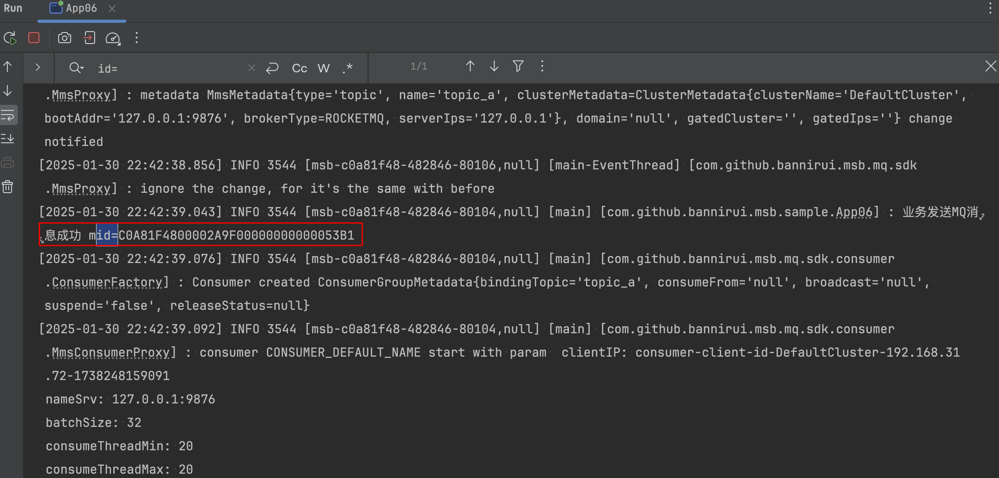
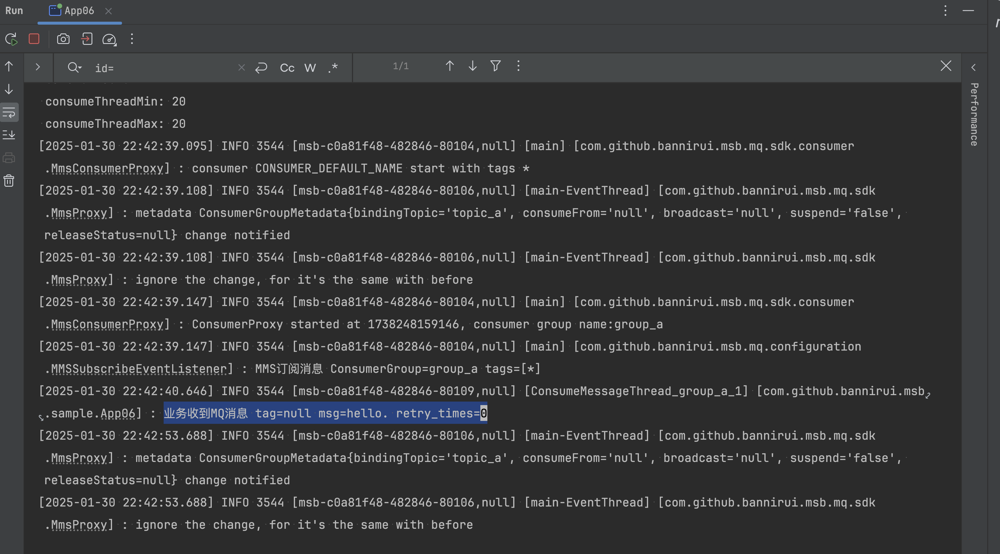

集成MQ
---

[关于RocketMQ的部署](https://bannirui.github.io/2025/01/09/Docker/%E9%83%A8%E7%BD%B2RocketMQ/)

### 1 maven的依赖GAV

```xml
<parent>
    <groupId>com.github.bannirui</groupId>
    <artifactId>my-springboot</artifactId>
    <version>3.2.4</version>
</parent>
```

依赖的client在项目[mms](https://github.com/Bannirui/my-message-service.git)中

### 2 配置文件

classpath:META-INF/app.properties

```properties
app.id=SampleApp
```

### 3 msb Apollo配置

```properties
# mq server, split by comma, zk addr
mms.nameServerAddress = 127.0.0.1:2181
```

### 4 业务Apollo配置

```properties
# the option for console log, true enable and false disable, the default is enabling
console.log = true

# determines the log level
logging.level.root = info
```

### 5 启动类注解

- @EnableMsbFramework
- @EnableMsbConfig
- @EnableMsbLog
- @EnableMsbMQ

```java
@EnableMsbFramework
@EnableMsbConfig
@EnableMsbLog
@EnableMsbMQ
public class App06 implements ApplicationRunner {

    private static final Logger log = LoggerFactory.getLogger(App06.class);
    @Autowired
    MMSTemplate mmsTemplate;

    public static void main(String[] args) {
        SpringApplication.run(App06.class, args);
    }

    @MMSListener(consumerGroup = "consumer1")
    public MMSResult listen(
                                 @MMSListenerParameter(name = MQMsgEnum.TAG) String tag,
                                 @MMSListenerParameter(name = MQMsgEnum.BODY) String body,
                                 @MMSListenerParameter(name = MQMsgEnum.RECONSUME_TIMES) String reconsumeTimes
    ) {
        log.info("业务收到MQ消息 tag={} msg={} retry_times={}", tag, body, reconsumeTimes);
        return MMSResult.status(MsgConsumedStatus.SUCCEED);
    }

    @Override
    public void run(ApplicationArguments args) throws Exception {
        while (true) {
            Thread.sleep(5_000L);
            // mq发送消息
            log.info("开始发送消息");
            String mid = this.mmsTemplate.send("topic1", "1", "hello.");
            log.info("业务发送MQ消息成功 mid={}", mid);
        }
    }
}
```

### 6 运行参数
```shell
-Denv=dev -Dconsole.log=true -Dapollo.configService=http://127.0.0.1:8081/ -Dapollo.autoUpdateInjectedSpringProperties=true -DCAT_HOME=/Users/dingrui/MyDev/code/java/cat/docker
```

### 7 运行结果



