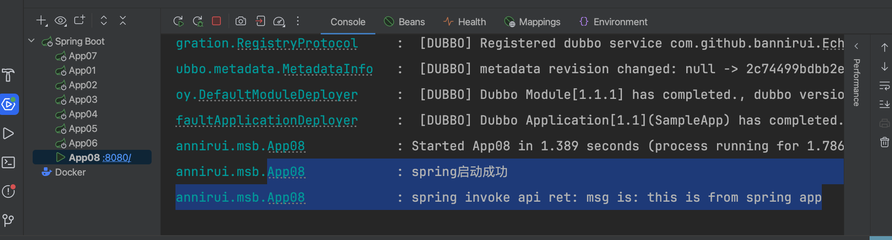

日志集成Cat
---

### 1 maven的依赖GAV
```xml
<parent>
    <groupId>com.github.bannirui</groupId>
    <artifactId>my-springboot</artifactId>
    <version>3.2.4</version>
</parent>
```

### 2 配置文件

classpath:META-INF/app.properties

```properties
app.id=SampleApp
```

### 3 启动类注解

#### 3.1 服务生产者

```java
@EnableMsbFramework
@EnableMsbDubbo
public class App08 implements ApplicationRunner {

    private static final Logger logger = LoggerFactory.getLogger(App08.class);

    @Autowired
    Echo echo;

    public static void main(String[] args) {
        SpringApplication.run(App08.class, args);
    }

    @Override
    public void run(ApplicationArguments args) throws Exception {
        logger.info("spring启动成功");
        logger.info("spring invoke api ret: {}", echo.echo("this is from spring app"));
    }
}
```



#### 3.2 服务消费者
todo
