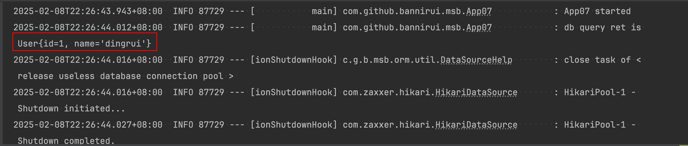

日志集成Cat
---

### 1 maven的依赖GAV

```xml
<parent>
    <groupId>com.github.bannirui</groupId>
    <artifactId>my-springboot</artifactId>
    <version>3.2.4</version>
</parent>
```

### 2 配置文件

classpath:META-INF/app.properties

```properties
app.id=SampleApp
```

### 3 启动类注解

```java
@EnableMsbFramework
@EnableMyBatis
public class App07 implements ApplicationRunner {
  private static final Logger log = LoggerFactory.getLogger(App07.class);

  @Autowired
  UserDao userDao;

  @Override
  public void run(ApplicationArguments args) throws Exception {
    log.info("App07 started");
    User ans = this.userDao.selectByPrimaryKey(1L);
    log.info("db query ret is {}", ans);
  }

  public static void main(String[] args) {
    SpringApplication.run(App07.class, args);
  }
}
```
### 4 运行结果

